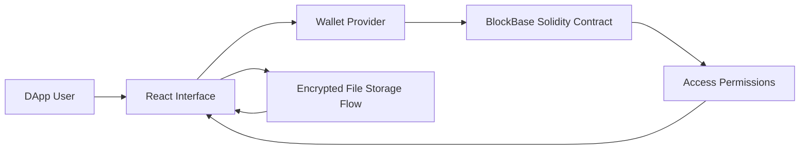

# Blockbase

<p align="center">

  
  
  
</p>

<p align="center">
  <strong>A decentralized file storage and access-control application combining a React interface with smart-contract based permission logic.</strong>
</p>

Blockbase explores how encrypted files, blockchain-based ownership, and access permissions can work together in a user-facing application. The project includes a Solidity contract and a React frontend for interacting with decentralized storage workflows.

## Core Capabilities

- Provides a React interface for decentralized file workflows.
- Implements Solidity contract logic for access control.
- Uses ethers for blockchain interaction from the frontend.
- Frames a secure upload and permission-management model.

## Technical Architecture

The application uses a Create React App frontend with smart contract code stored alongside the client source. The frontend interacts with contract logic through ethers and organizes the user workflow around file storage and permission management.

## Architecture Diagram



## Technology Stack

- React and JavaScript for frontend delivery.
- Solidity smart contract for access-control logic.
- ethers for blockchain provider and contract interaction.
- OpenZeppelin contracts for smart contract foundations.
- React testing utilities from the standard frontend toolchain.

## Repository Structure

- `src/App.js` - Frontend application shell.
- `src/BlockBase.sol` - Smart contract implementation.
- `src/index.js` - React entry point.
- `package.json` - Frontend scripts and blockchain dependencies.

## Getting Started

```bash
npm install
```

```bash
npm start
```

## Professional Context

This project demonstrates decentralized application development, smart-contract interaction, and secure permission-oriented product design.
